# MeteoJet 🌤️

<div align="center">

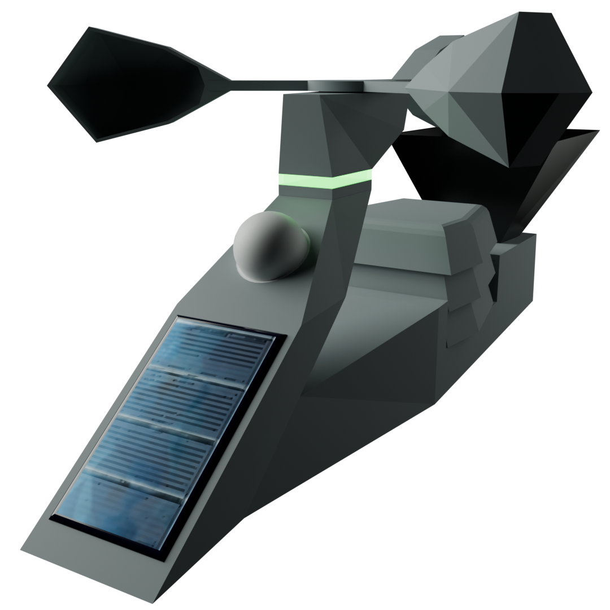

**A battery-powered 3D-printed Zigbee weather station, fully compatible with Zigbee2MQTT and Home Assistant.**

[](https://creativecommons.org/licenses/by-nc-sa/4.0/)
[](https://www.zigbee2mqtt.io/)
[](https://www.home-assistant.io/)
[](https://github.com/fc0076/MeteoJet/tree/main/3D_parts)

</div>

---

## 📖 Table of Contents

- [Description](#description)
- [Components List](#components-list)
- [3D Printing](#3d-printing)
- [Assembly](#assembly)
- [Firmware & Pairing](#firmware--pairing)
- [Calibration](#calibration)
- [How It Works](#how-it-works)
- [Support the Project](#support-the-project)
- [License](#license)

---

## Description

MeteoJet is a battery-powered weather station that transmits data using the **Zigbee protocol**, fully compatible with **Zigbee2MQTT** and **Home Assistant**. It features an original design inspired by a jet ski or water scooter, and is entirely made from **3D-printed parts** assembled with screws and glue.

<div align="center">

[](https://www.youtube.com/watch?v=s1psmz0XHgw)

</div>

<div align="center">


</div>

### Features

- 🌬️ **Anemometer** — measures average wind speed and gusts
- ☀️ **Light sensor (Lux meter)** — measures ambient light intensity
- 🔋 **Solar panel** — for battery recharging
- 🌡️ **Temperature, humidity & barometric pressure sensor**
- 🌧️ **Rain detector** — detects the presence of rain
- 📏 **Rain gauge** — measures rainfall intensity: current, last hour, last 24h, last 48h, last 3 days and last 7 days
- 🔋 **Battery level monitor**
- 💡 **4-LED strip (WS2812)** — visual status indicator for various events
- 🔘 **Button** — for various functions (reset, pairing, etc.)

### Power Management

MeteoJet is designed to run on battery and recharge via solar energy. Battery life depends on capacity and data transmission frequency. When the battery drops below a certain threshold, MeteoJet activates **energy rationing** to survive as long as possible — progressively reducing update frequency and light effects. It can last **weeks without sunlight**. Solar charging is fast, especially from a depleted state, since almost all solar energy is directed to the battery.

MeteoJet is **quick to alert** in case of rain or wind — generally within about ten seconds. With a low battery, this may extend to a minute or more.

---

## Components List

### Electronic Components

> ⚠️ All boards must be compatible with **3.3V** supply voltage.

| Component | Description | Image |
|-----------|-------------|-------|
| **Mini ESP32-H2** | Development board with Zigbee radio — the heart of the system | 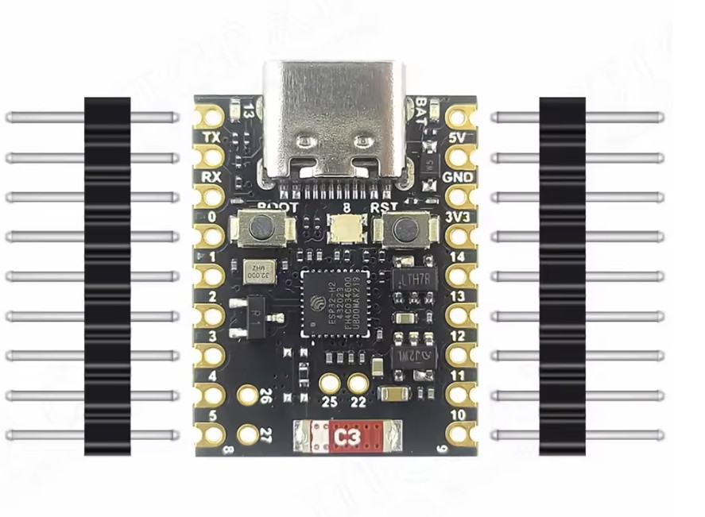 |
| **BME-280 3.3V** | Temperature, humidity and barometric pressure sensor. ⚠️ Do NOT buy BMP-280 — very similar but lacks the humidity sensor | 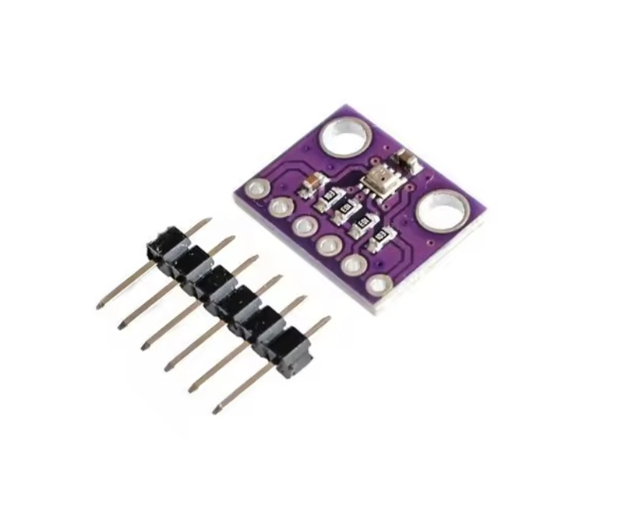 |
| **BH1750** | Ambient light (lux) sensor. Get the one with a **white cover** to protect it from weather | 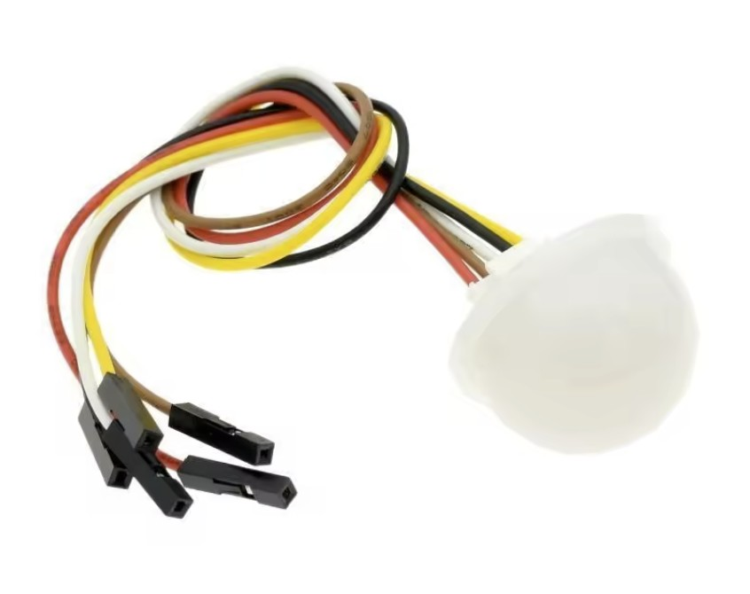 |
| **CN3791 6V** | Solar battery charger board | 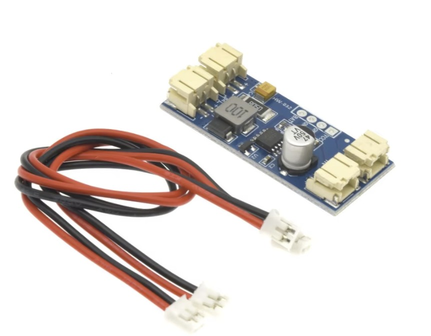 |
| **Solar Panel 80×45mm** | Solar panel — must be exactly 80×45mm to fit the 3D-printed housing | 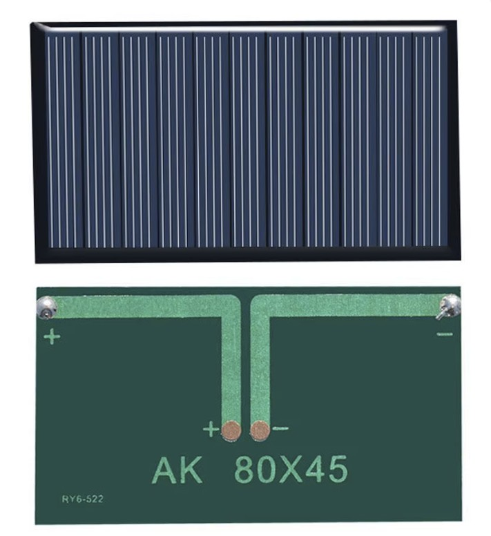 |
| **MAX17043** | Battery state-of-charge monitor | 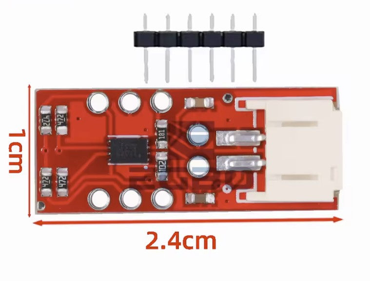 |
| **Li-ion / LiPo Battery 3.7V** | Recommended capacity: ≥2000mAh. Preferred size: 50×34×10mm. JST PH 2.0mm 2-pin connector recommended. The battery bay accommodates various formats, secured with cable ties |  |
| **LED 4-bit (WS2812)** | Square WS2812 LED for station status indication. Optional — if installed, print the window in transparent or white PETG |  |
| **FC-37** | Rain sensor board with sensor pad | 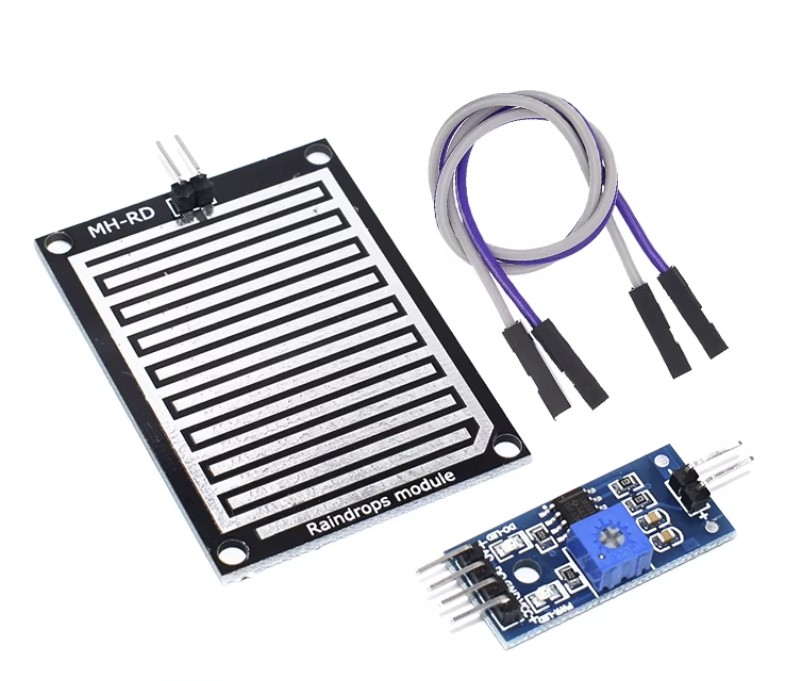 |
| **Reed Switch 14mm** | Used for wind and rain measurement. Size: ~14×3×3mm. 2 pieces needed (usually sold in larger kits) |  |
| **Magnet for Reed Switch** | Exact size: **6×2mm**. 2 pieces needed. Buy separately if not included with the reed switch | 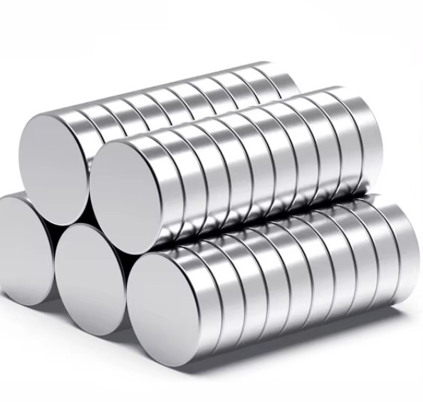 |
| **Button 6×6** | External button for various functions (reset, pairing, etc.). Length: 11–12mm. Optional — the ESP32 boot button can be used instead | 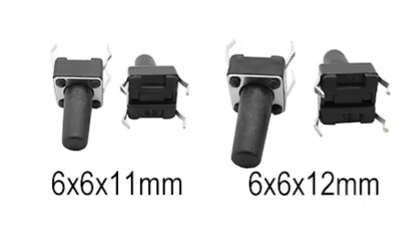 |
| **PCB Prototype Board 30×70mm** | Recommended for assembling the electronic components |  |
| **Wires & Connectors** | Various colors and types as preferred | |

### Mechanical Components

| Component | Description | Image |
|-----------|-------------|-------|
| **608RS** | 608RS ball bearing | 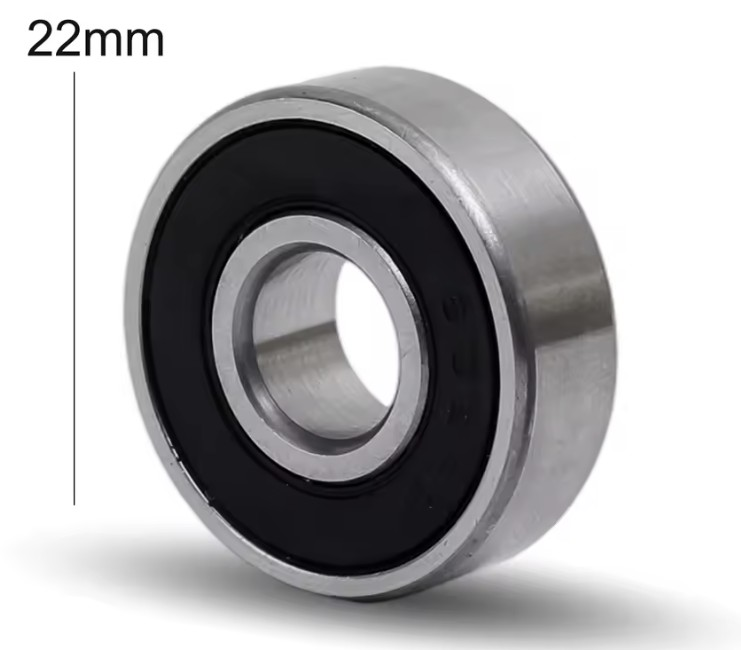 |
| **Screws** | M2×10mm and M2.5×16mm countersunk head screws | |
| **Plastic Glue** | For bonding 3D-printed parts | |

### Example Component Links

A shopping wishlist with example components is available here:  
👉 [AliExpress Wishlist](https://www.aliexpress.com/p/wish-manage/share.html?spm=a2g0o.order_list.headerAcount.6.344e3696hLkJNd&wishGroupId=800000018963311&smbPageCode=wishlist-amp&spreadId=91FA5ADABD1C81FB8FEF6FC2CF92D340FB675D4090C7E7ADA38B3E56E83BEADE)

---

## 3D Printing

MeteoJet is made up of multiple parts assembled together — some with glue, others with screws. The repository includes all **STL files** and **3MF project files** with preset print settings.

**General printing recommendations:**
- **3–4 perimeter walls** and **30–40% infill** for better strength
- Use **supports** where required — they are all hidden inside the model for a cleaner look
- All external parts are **snap-fit and must be glued** before deployment — glue also serves as a waterproofing seal
- Use **brim** to prevent warping on longer parts

<div align="center">

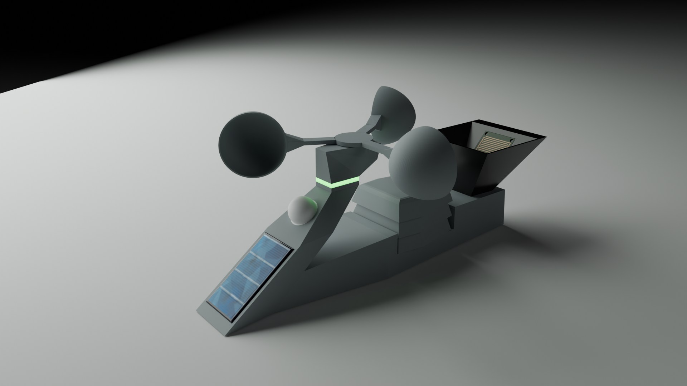

</div>

### Parts Overview

#### Front Section
| Part | STL | 3MF |
|------|-----|-----|
| **Basement** — houses most of the electronics | [Front body - Basement.stl](3D_parts/objects/Front%20body%20-%20Basement.stl) | [3mf](3D_parts/printer/Front%20body%20-%20Basement.3mf) |
| **Cover** — top section where solar panel and light sensor fit | [Front body - Cover.stl](3D_parts/objects/Front%20body%20-%20Cover.stl) | [3mf](3D_parts/printer/Front%20body%20-%20Cover.3mf) |

#### Anemometer Section
| Part | STL | 3MF | Notes |
|------|-----|-----|-------|
| **Body** — support for cups, houses LED, ball bearing and reed switch | [Anemometer - Body.stl](3D_parts/objects/Anemometer%20-%20Body.stl) | [3mf](3D_parts/printer/Anemometer%20-%20Body.3mf) | Requires two-color printing (AMS or manual filament change) |
| **Rotor** — rotating part with cups and reed switch magnet | [Anemometer - Rotor.stl](3D_parts/objects/Anemometer%20-%20Rotor.stl) | [3mf](3D_parts/printer/Anemometer%20-%20Rotor.3mf) | |
| **Hemispherical Cup** (×3) — excellent aerodynamic performance | [Anemometer - Hemispherical cup.stl](3D_parts/objects/Anemometer%20-%20Hemispherical%20cup.stl) | | Classic design |
| **Angular Cup** (×3) — lower performance, better visual match | [Anemometer - Angular cup.stl](3D_parts/objects/Anemometer%20-%20Angular%20cup.stl) | [3mf](3D_parts/printer/Anemometer%20-%20Angular%20cups.3mf) | |
| **Lower LED Support** | [Stripled - Bottom support.stl](3D_parts/objects/Stripled%20-%20Bottom%20support.stl) | [3mf](3D_parts/printer/Stripled%20-%20Supports.3mf) | |
| **Upper LED Support** | [Stripled - Top support.stl](3D_parts/objects/Stripled%20-%20Top%20support.stl) | | |

#### Rear Section
| Part | STL | 3MF |
|------|-----|-----|
| **Basement** — houses temperature/humidity sensor and tipping bucket rain gauge | [Rear body - Basement.stl](3D_parts/objects/Rear%20body%20-%20Basement.stl) | [3mf](3D_parts/printer/Rear%20body%20-%20Basement.3mf) |
| **Cover** — protects basement, includes Stevenson screen support and water tank | [Read body - Cover.stl](3D_parts/objects/Read%20body%20-%20Cover.stl) | [3mf](3D_parts/printer/Read%20body%20-%20Cover.3mf) |
| **Stevenson Screen Bottom Dome** (×2) | [Stevenson screen - Bottom dome.stl](3D_parts/objects/Stevenson%20screen%20-%20Bottom%20dome.stl) | [3mf](3D_parts/printer/Stevenson%20screen%20-%20Bottom%20domes.3mf) |
| **Stevenson Screen Top Dome** (×1) | [Stevenson screen - Top dome.stl](3D_parts/objects/Stevenson%20screen%20-%20Top%20dome.stl) | |
| **Tilting Part** — tipping bucket that counts rainfall | [Rain gauge - Tilting part.stl](3D_parts/objects/Rain%20gauge%20-%20Tilting%20part.stl) | [3mf](3D_parts/printer/Rain%20gauge%20-%20Tilting%20part.3mf) |
| **Tank** — water collection tank with rain sensor pad | [Rain gauge - Tank.stl](3D_parts/objects/Rain%20gauge%20-%20Tank.stl) | [3mf](3D_parts/printer/Rain%20gauge%20-%20Tank.3mf) |

#### Mounting Supports
| Part | STL |
|------|-----|
| **Arm** | [Support - Arm.stl](3D_parts/objects/Support%20-%20Arm.stl) |
| **Nut** | [Support - Nut.stl](3D_parts/objects/Support%20-%20Nut.stl) |
| **Plate** | [Support - plate.stl](3D_parts/objects/Support%20-%20plate.stl) |

---

## Assembly

<div align="center">

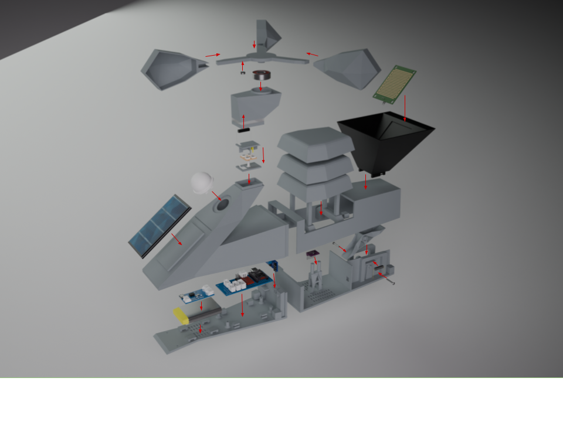

</div>

<div align="center">

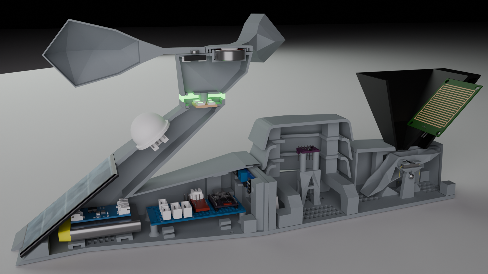

</div>

### Schematic

<div align="center">


</div>

📄 Full schematic also available as [PDF](schematic/MeteoJet%20schematic.pdf).

---

### Electronic Assembly

The front basement houses the following components:
- Li-ion 3.7V battery
- CN3791 (solar charger)
- MAX17043 (battery level monitor)
- ESP32-H2 (microcontroller)
- FC-37 (rain sensor)
- External button

It is recommended to use a **prototype PCB board** to solder the main components and connectors for all sensors. **Do not solder sensor wires directly to the main board** — use connectors so the station can be disassembled. Route all sensor cables to the front body through the designated holes.

<div align="center">

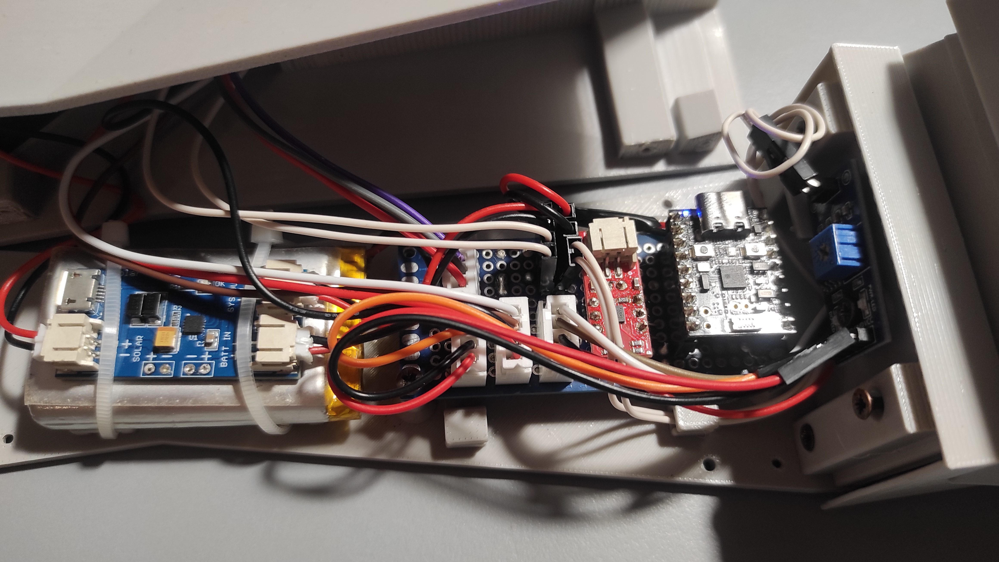
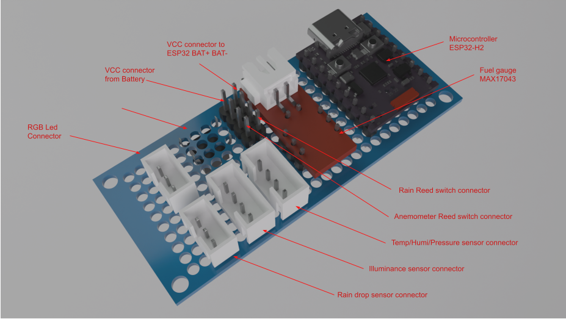

</div>

---

### Front Basement

The front basement houses most components and is designed to be as waterproof as possible. A ventilation grid at the bottom allows air circulation and helps drain any condensation.

- Fix the mainboard with screws — ensure the button on the bottom fits into its slot without friction (enlarge the hole if needed)
- Secure the battery and solar charger board with **cable ties** through the designated holes
- Mount the rain sensor vertically with a small screw — slightly bend the pins if connectors touch the walls

### Front Cover

- Solder two wires to the **+** and **–** pads of the solar panel and glue it into its slot — apply glue evenly to prevent water infiltration (the slot is a snug fit by design; use a file to enlarge if needed)
- Insert the light sensor connector and its white cover, then glue everything into place with a uniform layer of glue

### Anemometer & LED

- Press the **ball bearing** firmly into its slot (use a hammer gently — it's a press fit by design)
- Glue the **anemometer cups** to the rotor body
- Insert and glue the **reed switch magnet** in the hole at the bottom of the rotor
- Solder two wires to the reed switch and install it inside the anemometer body using tweezers — it should snap into the holders, otherwise use glue

> ⚠️ **IMPORTANT:** The reed switch must be aligned with the magnet. Before gluing, use a multimeter to verify that as the rotor passes the magnet over the reed switch, the contact opens/closes correctly.

- Solder wires to the WS2812 LED strip
- Sandwich the LED strip between the two supports, routing both LED wires and reed switch wires through the designated holes
- Insert the assembly into the anemometer body and glue it to the neck of the front section

### Rear Basement

- Fix the **temperature/humidity sensor** on top of the tower with screws — use just one of the two pillars and trim the other to minimize heat exposure
- Press and glue the **magnet** into the tipping bucket slot
- Insert the **tipping bucket** in the center position using two small nails as pivot pins
- The bucket must be **well-balanced** and flip smoothly with no friction
- Use two screws at the bottom to adjust balance — turning the screws changes the bucket height and therefore the tipping point

> 💧 **Calibration tip:** Use a graduated syringe to pour water into each side and adjust the screws until both buckets tip with the same amount of water. This is critical for accurate rainfall measurement.

- Once the tipping bucket is in place, install the **second reed switch** in its holder — verify with a multimeter that tipping the bucket activates the contact correctly before final assembly

### Rear Cover

- Insert the **rain sensor pad** firmly into its slot inside the water collection tank
- Use tweezers from below to attach a connector for the two wires that run to the central panel area

### Final Step

1. Join the front and rear basements with **4 screws**
2. Route all rear sensor cables/connectors through the hole into the front section
3. Close the rear section with its cover, secured with **4 screws** at the base
4. Snap the **Stevenson screen domes** and **water collection tank** into the rear cover — ensure the rain sensor wires don't obstruct the tipping bucket movement
5. Connect all sensor connectors to the mainboard
6. Close the front cover with **4 screws**

**MeteoJet is ready! 🎉**

---

## Firmware & Pairing

### Zigbee2MQTT Converter

Navigate to your Z2M configuration folder (usually `config/zigbee2mqtt`) and copy the two folders from this repository:

```
home_assistant/config/zigbee2mqtt/device_icons/
home_assistant/config/zigbee2mqtt/external_converters/
```

Without the external converter, Z2M will not recognize MeteoJet. Restart Z2M after copying — check the log to confirm the converter loaded successfully.

### Firmware Flashing

The latest firmware binary is available in the [`firmware/`](firmware/) folder.

Connect the ESP32-H2 via **USB-C** to your computer, configure the correct COM port (refer to the many guides available online), then flash the firmware using a tool of your choice. **ESPHomeFlasher** works great.

### Pairing

Once powered on, MeteoJet automatically enters pairing mode. Open Z2M and start device interview/association. Z2M will detect and install MeteoJet. After successful pairing, the device should display a **blue arrow icon** — indicating it is correctly installed and operational.

> If the first connection fails, retry — the Z2M interview process doesn't always succeed on the first attempt after pairing.

<div align="center">

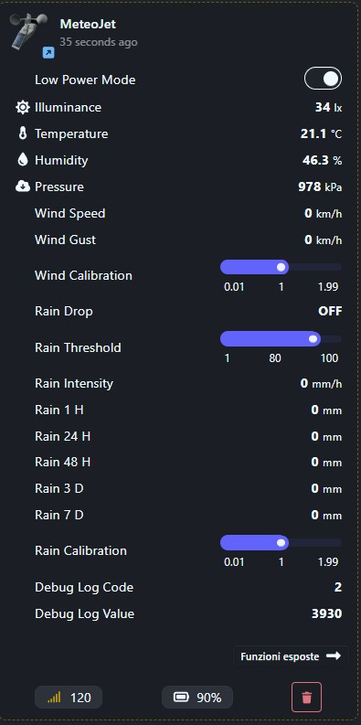

</div>

---

## Calibration

> 🚧 *Documentation coming soon.*

---

## How It Works

> 🚧 *Documentation coming soon.*

---

## Support the Project

If you find MeteoJet useful and want to support the development, feel free to buy me a coffee! ☕

<div align="center">

[](https://www.buymeacoffee.com/)

</div>

Your support helps keep the project alive and motivates further development. Even a ⭐ star on this repository goes a long way!

---

## Contributing

Contributions, issues and feature requests are welcome! Feel free to:

- Open an [issue](https://github.com/fc0076/MeteoJet/issues) to report bugs or suggest improvements
- Submit a pull request with your enhancements
- Share your build and photos — I'd love to see MeteoJet in the wild!

---

## License

This project is licensed under the **Creative Commons Attribution-NonCommercial-ShareAlike 4.0 International (CC BY-NC-SA 4.0)**.

[](https://creativecommons.org/licenses/by-nc-sa/4.0/)

You are free to:
- ✅ **Build** MeteoJet for personal, non-commercial use
- ✅ **Share** and adapt the project, as long as you credit the original author
- ✅ **Modify** and redistribute, under the same license

You are **not** allowed to:
- ❌ **Sell** MeteoJet or any derivative of it without explicit written permission from the author
- ❌ **Use** this project or any part of it for commercial purposes
- ❌ **Relicense** under more permissive terms

For commercial licensing inquiries, please open an [issue](https://github.com/fc0076/MeteoJet/issues) or contact the author directly.

---

<div align="center">

Made with ❤️ and a 3D printer

⭐ If you like this project, please consider starring the repository!

</div>
